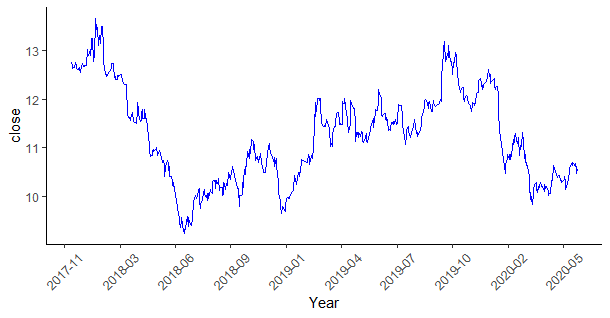
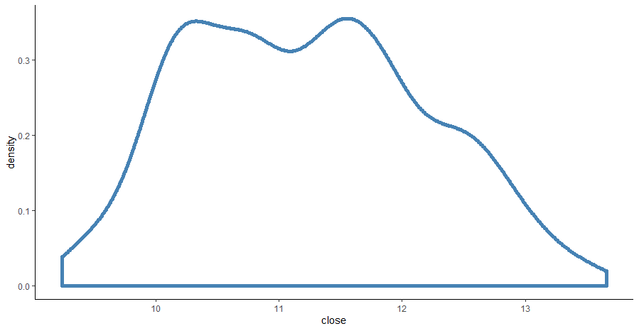
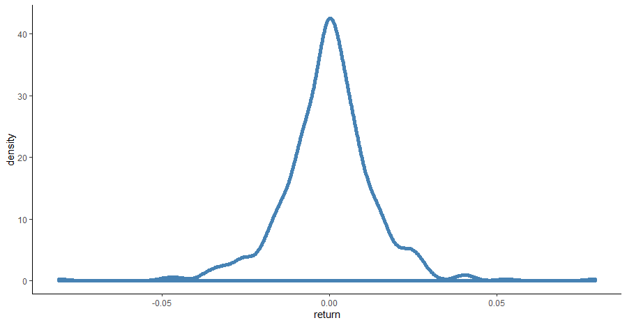

```{r setup, include=FALSE}
knitr::opts_chunk$set(prompt=TRUE, comment='', warning=FALSE, results="hold")
setwd("D:/Stat")
```

\begin{abstract}
自JP摩根银行开发VaR方法以来，VaR这一风险管理工具在金融市场的风险管理中得到了广泛应用。本文采取了上海浦发银行的股票数据，通过R语言做实证分析，在检验浦发银行股价符合一般股票的价格规律基础上，利用历史模拟法和蒙特卡洛模拟法分别预测其VaR值，并进行比较。最终，预测结果使用Kupiec检验法进行检验，比较得出更适合预测VaR的模型。

\par\textbf{关键词: }金融市场；VaR；历史模拟法；蒙特卡洛方法
\end{abstract}

## 1. 引言
自1923年由JP摩根提出的VaR模型后，VaR这一风险管理工具被越来越多的金融机构所采用，成为一种度量市场风险的重要方法。因此，针对VaR值的计算和预测方法的研究对金融机构监控市场风险和投资者衡量市场风险具有重要的意义。

本文选取自2017年12月13日到2019年5月28日的日收盘价数据作为分析样本数据，2019年5月29日到2020年6月12日的255个日收盘价数据作为检验样本数据；利用样本数据分别进行历史模拟法和蒙特卡洛模拟法的模拟和预测，最后，利用Kupiec检验法对两模型的预测结果与检验样本数据进行比较。

## 2. 模型的准备与建立

VaR是指在一定的持有期及置信度内，某一证券或其他金融资产所面临的的最大的潜在损失。用数学公式可表示为：
$$
prob(\Delta P > VaR)=1-T
$$

历史数据法是依据资产的历史损益数据计算当前资产的损益数据，将$N$个历史收益数据从低水平到高水平一次排列，位于$(1-\alpha) \times N$处的临界收益值$R^*$即为VaR的估计值。该方法纯粹从获得的历史收益数据中进行简单计数得到VaR值。

蒙特卡洛算法是一种随机模拟方法，与历史模拟法不同的是它用市场因子的历史波动产生未来波动的大量可能路径，并估计分布的参数，然后用相应的“随机数发生器”产生大量的符合历史分布的可能数据，从而构造出组合的可能损益。在这样得到的大量组合的可能损益中，按照给定的置信水平得到风险值VaR的估计。

## 3. 样本的建立与数据的基础性分析

### 3.1 浦发银行收盘价的总体趋势



从图1中可以看出，样本期间浦发银行的股价最高上涨至13.66元，最低下跌至9.24元，在这一区间呈震荡起伏的特征，期间有明显的的下跌和上升的趋势。

### 3.2 描述性统计指标的分析

\begin{table}[]
\centering
\caption{浦发银行股票的描述性分析}
\begin{tabular}{ccc}
\hline
& 股价 & 收益率 \\
\hline
观测数 & 607         & 606        \\
最小值 & 9.240000    & -0.080704  \\
最大值 & 13.660000   & 0.079414   \\
平均值 & 11.235288   & -0.000313  \\
中位数 & 11.230000   & 0.000000   \\
众数   & 10.060000   & 0.000000   \\
求和   & 6819.820000 & -0.189405  \\
标准差 & 0.961302    & 0.013515   \\
方差   & 0.924102    & 0.000183   \\
偏度   & 0.212558    & -0.111973  \\
峰度   & -0.765666   & 4.726527   \\
\hline
\end{tabular}
\end{table}

通过表1可知浦发银行股价在样本期间最高为13.66元，最低为9.24元，均值为11.24元，中位数为11.23元，从数值上来看，均值不处于中位数和众数之间，这说明样本数据是一个对称分布。进一步看偏度和峰度指标，峰度K=-0.77<0，偏度S=0.21>0，这表明样本数据不服从正态分布。

### 3.3 绘制频数密度图





通过图3我们发现，浦发银行的对数收益率序列具有金融资产波动的通性及尖峰厚尾分布，集聚性和非对称性等。对数收益率明显的尖峰厚尾分布特征表明股价处于均值附近、高收益区域和高亏损区域出现的概率大于正态分布决定的概率，同时，我们不能用理论的正态分布来刻画收益率，这样会低估极端事件的发生。

在了解了股票收益率特征的基础上，可以假设用VaR法来估算一项投资的风险价值。根据估算模型和波动性模型的不同，可以将VaR的计算分为历史模拟法和蒙特卡洛法。此处分别用两种方法计算：假设我们一直在2019年8月30日的股价是11.28元，下一个交易日，在95%的置信水平下，该投资者的最大损失是多少？

## 4. 实证分析

### 4.1 用历史模拟法获取VaR

在历史模拟法下，对该问题的解决步骤如下：

1.确定风险因子。本例中我们只考虑浦发银行股票本身的变动，不引入其他因子（如股票指数变动、利率变动等），即通过资产价格计算资产损益。具体地说，浦发银行的损益R是股价P的函数，用公式表示：股票损益$R_t=$卖出价$P_t-$买入价$P_{t-1}$。

2.建立样本。根据巴塞尔委员会和我国银监会的要求，历史模拟法的样本数据至少应包括250个。另外考虑到样本数据的时效性和可参照性，本例选择2017年12月13日到2019年5月28日每个交易日的浦发银行收盘价，共352个数据建立分析样本。

3.模拟头寸损益。将个股浦发银行头寸回放到过去的352天中，模拟头寸价值序列值$V_t$，进而计算模拟头寸的逐日损益$R_t=V_t-V_{t-1}$。

4.求解VaR。取损益序列中的95\%分位数的值即为VaR值。我们得知2019年5月28日的VaR值约为2.46\%。

### 4.2 用蒙特卡洛模拟法获取VaR值

1.针对数据建立GARCH模型，预测出均值和方差方程。

2.进行蒙特卡洛模拟。先生成一个t分布的表格，行数代表天数，列数代表预测的数据点数目（t分布上的点的数目）。之后遍历所有的列和该列的每一行，并计算当前日期的方差。根据方差计算出经过t分布的标准化残差转化后的残差，将残差加到均值方程当中得到当前值，并将一周的交易日的值相加就得到了损失的总量。最终能得到为期限5天的3000个波动率数据点的分布。

3.求解VaR。最终得到的数据点分布还是按照之前的95\%分位点的方法去取得VaR，我们得知通过蒙特卡洛模拟法计算出来的2019年5月28日的VaR值为6.55\%。

### 4.3 综合比较分析

历史模拟法计算出来的VaR值为2.46\%，而基于GARCH模型的蒙特卡洛法计算出来的VaR=6.55\%，二者存在着较大的差异，其原因在于这两种方法的基本设计原理不同。

历史模拟法为向前模拟，以历史真实交易属于为样本，与样本期内变量的波动幅度有关。在整个样本期内，“坏的情景”出现的次数及其程度对最终的结果有着关键性的影响。

而基于GARCH模型的蒙特卡洛法为向后模拟，以当前情景为起点，模拟变量的未来变化，因此，当前情景的好坏对最终结果的影响非常大。

此外，样本量的不同也是导致二者存在差异的原因。在历史模拟法下，样本数据来自于真实的样本交易，一般样本长度为1-3年，即250-750个交易日。虽然从统计的角度来看，样本容量越大，计算结果可能越精确，但具体到VaR的计量，却未必如此。样本规模越大，意味着要往前追溯的时间越长，历史越久远，对现实和未来的影响可能就越弱，因此历史模拟法的样本规范一般都不会太大。

在基于GARCH模型的蒙特卡洛算法下，样本来自于对未来情景的直接模拟生成，理论上说，这个样本的容量是无限大的。一般也要求样本容量足够大，至少以万次为单位，动辄百万、千万甚至亿万次。理论上讲，通过这样大容量地反复模拟，对未来结果的覆盖面就越宽，而历史模拟法由于样本容量有限，覆盖面相应也就有限。

一般来说，如果样本期间，股票价格呈显著的单边上升（或下跌）的趋势，用基于GARCH模型的蒙特卡洛算法计算出来的VaR会明显大于（或小于）历史模拟法计算出来的VaR。

### 4.4 Kupeic检验

目前处理模型风险最为常用的统计风险检验方法，是Kupiec在1995年提出的似然率（likelihood ratio，下文简记为LR）方法，这种方法非常简单并且具有一定的可靠性，为大多数风险检验者所使用。

使用方法：将观测到的盈亏结果与测定的VaR值进行比较，超过测定VaR的例外情形可被视为一个二项分布中出现的独立事件。定义0-1变量$I_t=1$表示例外情形的发生，$I_t=0$表示没有发生超出VaR的损失。记$I_t=1$的样本数为$N$，则失败频率为$\hat{P}(=N/T)$，Kupiec检验的零假设为$\hat{P}=P$，其似然比检验的统计量为：
$$
LR_{uc}=-2\ln[(1-\hat{P})^{T-N}\hat{P}^N]+2\ln[(1-P)^{T-N}P^N]\sim \chi^2(1)
$$

在样本为255个样本点下，95\%置信度下VaR的失败次数区间为$[6,21]$。本文选取的测试样本为2019年5月29日到2020年6月12日共255个浦发银行日收盘价数据，基于Garch算法的蒙特卡洛模拟出来的VaR失效个数为25，十分接近$[6,21]$这一区间，而历史模拟法模拟出的VaR失效个数为56个。所以我们认为，在本文的实证分析中，基于Garch模型的蒙特卡洛法比历史模拟法的效果更好。

## 5. 总结

VaR方法表示处于风险状态的价值，此处应用在浦发银行股票上，分别用基于Garch时间序列模型的蒙特卡洛模拟法和历史模拟法计算在95\%置信水平下，该投资者的最大损失。其中历史模拟法概念直观、容易计算，能够有效地处理非对称和肥尾等问题。但是，历史模拟法假设市场因子在未来某个时间段里的变化与过去某个时间段的变化完全相同，这与现实金融市场的变化不完全吻合。蒙特卡洛方法快速简单，省却了复杂的数学推导和演算过程，但是蒙特卡罗法必须输入一个随机数，如果随机数输入不合理，将会影响整个实验结果。另外，选取的模拟次数如果过多，则会影响程序的效率，次数过少，则会使得模拟的结果与现实偏差较大。总体来说，蒙特卡洛法对VaR值的计算是优于历史模拟法的。

\newpage

# 参考文献

[1] 林琳熔,刘梦茹,邓成翔,钟明羿,周燕.基于VaR预测的历史模拟法与蒙特卡洛模拟法的比较[J].计算机产品与流通,2020(08):222.

[2] 林文豪,陈梅倩,周礼刚,孟晓旭.基于VaR-GARCH模型族的中国股市风险预测能力分析[J].统计与决策,2019,35(21):151-155.

[3] 赵鹏举,海洋,殷燕.基于GARCH-VAR模型的创业板指数收益率波动特征比较研究[J].价值工程,2019,38(25):5-9.

[4] 刘玲玲.风险价值分析——以皖通高速为例[J].时代金融,2019(22):33-36.

[5] 孟诗画.基于VaR—GARCH模型的我国商业银行汇率风险分析[J].广西质量监督导报,2019(07):170.

[6] 张健.基于改进的GARCH模型对VaR风险研究[J].经济研究导刊,2019(03):78-83.

[7] 郝韶龙.基于VaR(风险价值)的金融投资问题研究[J].科技经济导刊,2018,26(30):209+211.

[8] 邵明川. 风险评价的VaR方法及应用[D].青岛大学,2017.

[9] 任鹏程,徐静,李新民.风险价值VaR的区间估计[J].山东大学学报(理学版),2017,52(02):85-90.

[10] 王散激.基于历史模拟法的风险价值(VAR)计算及实证分析[J].科技展望,2016,26(23):172.

[11] 刘卉. 基于MCMC方法的时间序列VaR分析[D].清华大学,2016.

[12] 唐宁. 基于风险价值（VaR）模型与回测检验的统计研究及实证分析[D].西华师范大学,2016.

\newpage

# 附录

R语言代码

```{r, eval=FALSE}
library(ggplot2)
library(fBasics)

setwd("E:\\Courses\\Computational Statistics\\Final Thesis")

data <- read.csv("pufa_stock.csv", encoding="utf-8")

colnames(data)[1] <- "date"
colnames(data)

data <- data[order(data$date),]
rownames(data) <- c(1:nrow(data))

data$date <- as.character(data$date)

data.train <- data[data$date <= "2019-05-28",]
data.test <- data[data$date > "2019-05-28",]
rownames(data.test) <- c(1:nrow(data.test))

data$date <- as.Date(data$date, "%Y-%m-%d")

ggplot() + geom_line(data, mapping=aes(x=date, y=close, group=factor(1)), 
                     col="blue") + 
  xlab('Year') + 
  theme(axis.text.x=element_text(angle=45, hjust=0.5, vjust=0.5)) +
  theme(panel.grid.major=element_blank(), panel.grid.minor=element_blank(),
        panel.background=element_blank(), axis.line=element_line(colour="black")) + 
  scale_x_date(date_breaks='100 days', date_labels='%Y-%m')

data$log_close <- log(data$close)
return_data <- data.frame(date=data[['date']][2:nrow(data)],
                          return=diff(data$log_close))

basicStats(data$close)
basicStats(return_data$return)

ggplot(data, aes(x=close)) + geom_density(colour="steelblue", lwd=2) + 
  theme(panel.grid.major=element_blank(), panel.grid.minor=element_blank(),
        panel.background=element_blank(), axis.line=element_line(colour="black"))
ggplot(return_data, aes(x=return)) + geom_density(colour="steelblue", lwd=2) + 
  theme(panel.grid.major=element_blank(), panel.grid.minor=element_blank(),
        panel.background=element_blank(), axis.line=element_line(colour="black"))

# 历史模拟法计算VaR值
dd <- diff(log(data.train$close))
loss <- -dd * 100
VaR <- quantile(loss, 0.95)
VaR

# 蒙特卡洛模拟计算VaR值
library(tseries)
adf.test(data$close, alternative="stationary")
acf(data$close)
pacf(data$close)

## 建立GARCH模型
library(rugarch)
spec <- ugarchspec(mean.model=list(armaOrder=c(0,0)), 
                   variance.model=list(garchOrder=c(1,1)),
                   distribution.model='std')
fit <- ugarchfit(data=loss, spec=spec)
result <- coef(fit)

mu <- result[['mu']]
alpha <- c(result[['omega']], result[['alpha1']])
beta <- result[['beta1']]
df <- result[['shape']]
sig <- sigma(fit)

## 设置天数为一周，也就是5天
t <- 5
## 迭代次数
nround <- 5000

library(fGarch)
set.seed(123)
err <- matrix(rstd(t*nround, mean=0, sd=1, nu=df), t, nround)
init <- c(loss[length(loss)], sig[length(loss)])
xt <- NULL

# 以init为起点，进行nround轮迭代
for (j in 1:nround){
  lt <- NULL  # 初始化为空值
  at <- init[1] - mu  # 初始化残差
  vart <- init[2]^2  # 初始化方差
  for (i in 1:t){
    # 根据GARCH模型拟合出下一期方差
    var <- alpha[1] + alpha[2]*at[i]^2 + beta*vart[i]  
    vart <- c(vart,var)  # 前i期方差
    at <- c(at,sqrt(var)*err[i,j])  # 前i期残差
    lt <- c(lt, mu+at[i+1])  # 前i期的损失变量
  }  # 此循环结束后，得到未来5期的损失变量序列的一次模拟值lt
  xt <- c(xt,sum(lt))  # 未来5期的损失变量的一次总和
}  # 此循环结束后就得到5期损失变量总和的3000次模拟值

VaR2 <- quantile(xt, 0.95)
VaR2


# 进行Kupiec检验
num_his <- 0
num_mc <- 0 
for (r in 1:nrow(data.test)) {
  if (r == 1) {
    data_his <- data.train
  } else {
    data_his <- rbind(data.train, data.test[1:(r-1),])
  }
  dd <- diff(log(data_his$close))
  loss <- -dd * 100
  VaR <- quantile(loss, 0.95)
  
  spec <- ugarchspec(mean.model=list(armaOrder=c(0,0)), 
                     variance.model=list(garchOrder=c(1,1)),
                     distribution.model='std')
  fit <- ugarchfit(data=loss, spec=spec)
  result <- coef(fit)
  
  mu <- result[['mu']]
  alpha <- c(result[['omega']], result[['alpha1']])
  beta <- result[['beta1']]
  df <- result[['shape']]
  sig <- sigma(fit)
  t <- 5
  nround <- 7000
  
  err <- matrix(rstd(t*nround, mean=0, sd=1, nu=df), t, nround)
  init <- c(loss[length(loss)], sig[length(loss)])
  xt <- NULL
  
  for (j in 1:nround){
    lt <- NULL
    at <- init[1] - mu
    vart <- init[2]^2 
    for (i in 1:t){
      var <- alpha[1] + alpha[2]*at[i]^2 + beta*vart[i] 
      vart <- c(vart,var)  
      at <- c(at,sqrt(var)*err[i,j])
      lt <- c(lt, mu+at[i+1]) 
    } 
    xt <- c(xt,sum(lt)) 
  } 
  VaR2 <- quantile(xt, 0.95)
  
  if (r == 1) {
    ac_loss <- data.train[['close']][nrow(data.train)] - data.test[['close']][1]
  } else {
    ac_loss <- data.test[['close']][r-1] - data.test[['close']][r]
  }
  
  if (ac_loss > VaR[[1]] * 0.01) {
    num_his <- num_his + 1
  } 
  
  if (ac_loss > VaR2[[1]] * 0.01) {
    num_mc <- num_mc + 1
  } 
}

print(num_his)
print(num_mc)

VaR.back.test <- function(T, N) {
  p <- 0.05
  con.level <- 0.05
  prob <- 1 - p
  LR_POF <- -2*log((prob^N)*(1-prob)^(T-N))+2*log(((N/T)^N)*(1-N/T)^(T-N))
  critical <- qchisq(con.level, df=1);
  P_value <- pchisq(LR_POF, df=1, lower.tail=F)
  list(LR_POF,P_value)
}

VaR.back.test(nrow(data.test), num_his)
VaR.back.test(nrow(data.test), 50)
```